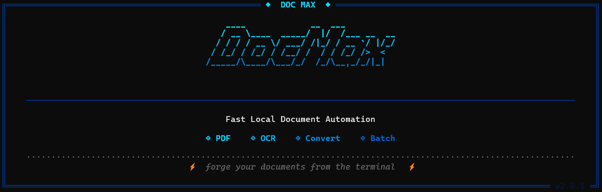
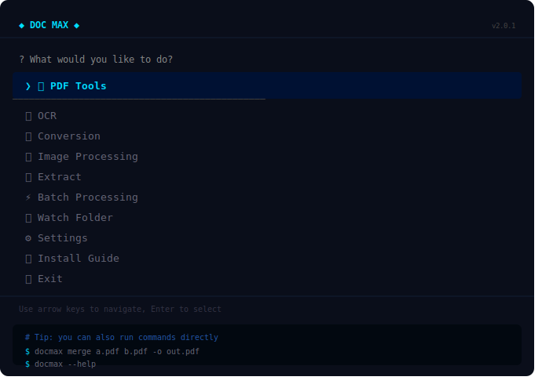
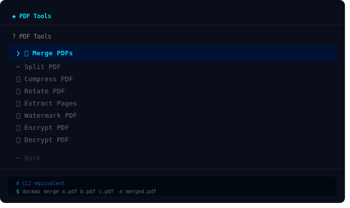
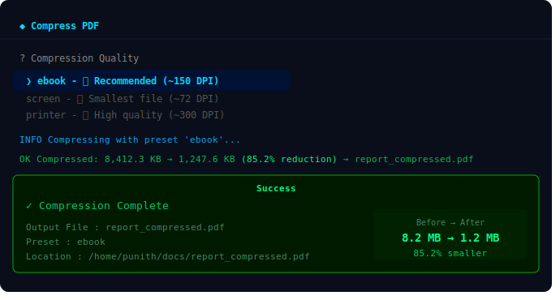
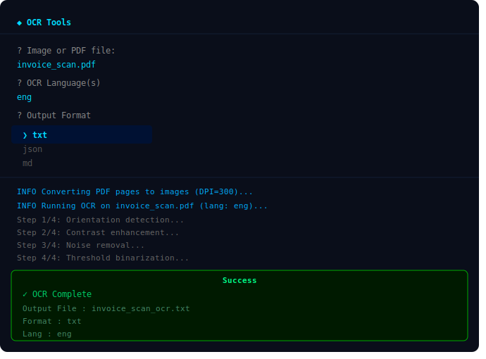
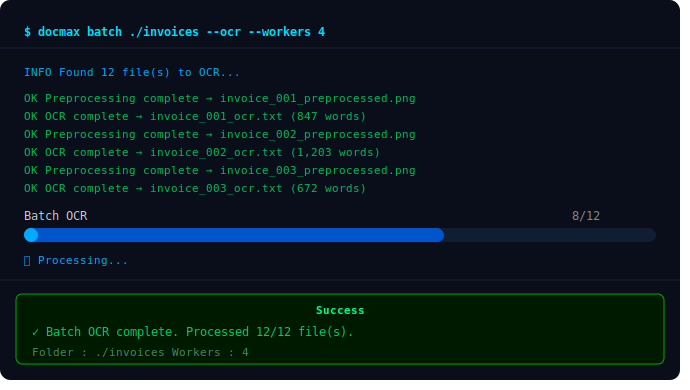
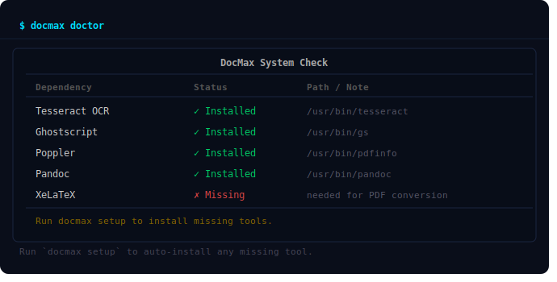

<div align="center">

# ◆ DocMax

**Forge your documents from the terminal.**

[](https://pypi.org/project/docmax/)
[](https://pypi.org/project/docmax/)
[](https://opensource.org/licenses/MIT)
[](https://pypi.org/project/docmax/)
[](https://pypi.org/project/docmax/)



DocMax is an **all-in-one, offline-first document processing CLI** published on [PyPI](https://pypi.org/project/docmax/).  
Merge PDFs, run OCR, convert formats, batch-process folders, and more — all from a single, beautiful terminal interface.

[Installation](#installation) • [Usage](#usage) • [Features](#features) • [Screenshots](#screenshots) • [Contributing](#contributing)

</div>

---

## ✨ Feature Gallery

<table>
<tr>
<td colspan="2" align="center">
<b>Main Menu</b><br/>

<sub>Launch with <code>docmax</code> — arrow-key navigation, guided workflows for every tool</sub>
</td>
</tr>
<tr>
<td align="center" width="50%">
<b>PDF Tools</b><br/>

<sub>8 PDF operations — all interactive and guided</sub>
</td>
<td align="center" width="50%">
<b>Compression Result</b><br/>

<sub>Ghostscript compression — real before/after sizes shown</sub>
</td>
</tr>
<tr>
<td align="center" width="50%">
<b>OCR Workflow</b><br/>

<sub>4-step preprocessing pipeline before Tesseract OCR</sub>
</td>
<td align="center" width="50%">
<b>Batch OCR</b><br/>

<sub>Multi-threaded batch processing with Rich progress bar</sub>
</td>
</tr>
<tr>
<td colspan="2" align="center">
<b>System Doctor</b><br/>

<sub><code>docmax doctor</code> — checks all external tools, shows paths and install status</sub>
</td>
</tr>
</table>

## 🚀 Features

<details open>
<summary><strong>📄 PDF Tools</strong></summary>

| Feature | Command |
|---|---|
| Merge multiple PDFs | `docmax merge a.pdf b.pdf -o out.pdf` |
| Split into pages | `docmax split report.pdf` |
| Compress (Ghostscript) | `docmax compress large.pdf --preset ebook` |
| Rotate pages | `docmax rotate file.pdf 90` |
| Extract page range | `docmax pages file.pdf 1-5` |
| Overlay watermark | `docmax watermark file.pdf logo.png` |
| Encrypt with password | `docmax encrypt file.pdf` |
| Decrypt | `docmax decrypt protected.pdf` |

</details>

<details>
<summary><strong>🔍 OCR</strong></summary>

| Feature | Command |
|---|---|
| OCR an image | `docmax ocr scan.png` |
| OCR a PDF | `docmax ocr scan.pdf` |
| Output as JSON or Markdown | `docmax ocr scan.pdf --fmt json` |
| Multi-language OCR | `docmax ocr scan.png --lang eng+hin` |
| Make scanned PDF searchable | `docmax searchable scan.pdf` |
| Batch OCR a folder | `docmax batch-ocr invoices/` |

</details>

<details>
<summary><strong>🔄 Document Conversion</strong></summary>

| Feature | Command |
|---|---|
| Markdown → PDF | `docmax convert notes.md pdf` |
| Markdown → DOCX | `docmax convert notes.md docx` |
| DOCX → PDF | `docmax convert report.docx pdf` |
| DOCX → Markdown | `docmax convert report.docx md` |
| Images → PDF | `docmax img2pdf scans/` |
| PDF → Images | `docmax pdf2img report.pdf --dpi 300 --fmt png` |

</details>

<details>
<summary><strong>📂 Content Extraction</strong></summary>

| Feature | Command |
|---|---|
| Extract text | `docmax text report.pdf` |
| Extract embedded images | `docmax images report.pdf` |
| Show / save metadata | `docmax metadata report.pdf -o meta.json` |
| Extract tables (CSV/XLSX/JSON) | `docmax tables invoice.pdf --fmt xlsx` |

</details>

<details>
<summary><strong>🖼 Image Processing</strong></summary>

| Feature | Command |
|---|---|
| Enhance (contrast + sharpness) | `docmax enhance scan.png` |
| Fix skewed scans (deskew) | `docmax deskew scan.png` |
| Remove noise | `docmax denoise scan.png` |
| Resize | `docmax resize photo.png --width 800` |
| Full OCR preprocessing pipeline | `docmax preprocess scan.png` |

Interactive image tools (resize, crop, rotate, flip, convert format, watermark, remove background) are also available in the TUI.

</details>

<details>
<summary><strong>⚡ Batch Processing & Watch Mode</strong></summary>

| Feature | Command |
|---|---|
| Batch OCR with workers | `docmax batch ./docs --ocr --workers 8` |
| Batch compress PDFs | `docmax batch ./pdfs --compress` |
| Batch convert to Markdown | `docmax batch ./docs --convert md` |
| Auto-OCR watched folder | `docmax watch ./incoming --ocr` |
| Auto-compress watched folder | `docmax watch ./uploads --compress` |
| Auto-make-searchable | `docmax watch ./scans --searchable` |
| Auto-preprocess images | `docmax watch ./images --preprocess` |

</details>

<details>
<summary><strong>⚙️ Setup & Diagnostics</strong></summary>

```bash
docmax setup    # Auto-install external dependencies (Tesseract, Ghostscript, Pandoc, Poppler)
docmax doctor   # Check which tools are installed and configured
```

</details>

---

## 📦 Installation

### Core (always works)

```bash
pip install docmax
```

### Optional extras

Install only what you need:

```bash
# OCR support (Tesseract + pdf2image)
pip install "docmax[ocr]"

# Advanced image processing (OpenCV, rembg background removal)
pip install "docmax[image]"

# Table extraction from PDFs (pdfplumber, pandas, openpyxl)
pip install "docmax[tables]"

# Everything
pip install "docmax[full]"
```

### External dependencies

Some features require system tools. Run `docmax setup` to auto-install them, or follow the manual links below.

| Tool | Purpose | Auto-install |
|---|---|:---:|
| [Tesseract OCR](https://tesseract-ocr.github.io/tessdoc/Installation.html) | OCR engine | ✅ |
| [Ghostscript](https://ghostscript.com/releases/gsdnld.html) | PDF compression | ✅ |
| [Pandoc](https://pandoc.org/installing.html) | Document conversion | ✅ |
| [Poppler](https://poppler.freedesktop.org) | PDF → image rendering | ✅ |

```bash
# Install & verify in two steps
docmax setup
docmax doctor
```

---

## 🖥 Usage

### Interactive TUI

Launch the full interactive terminal UI with no arguments:

```bash
docmax
```


Navigate with arrow keys, select with Enter. Every tool section has its own guided workflow.

### Command-Line Interface

DocMax also works as a traditional CLI — every feature is a subcommand:

```bash
# Show all commands
docmax --help

# Show version
docmax --version
```

---

## 📸 Screenshots

### Main Menu


> *Animated: the full interactive menu on launch.*

### PDF Tools


> *Merge, split, compress, rotate, watermark, encrypt and decrypt — all guided.*

### OCR Workflow


> *Animated: selecting a scanned PDF, choosing output format, and getting searchable text.*

### Compression Results


> *Side-by-side before/after size after Ghostscript compression.*

### Batch Processing


> *Animated: batch OCR across a folder with a live progress bar.*

### System Doctor


> *`docmax doctor` showing installed tool status and paths.*

---

> **Adding screenshots:** Place images under `docs/images/` in the repository root.  
> Recommended filenames: `banner.png`, `tui-main-menu.gif`, `pdf-tools-menu.png`, `ocr-demo.gif`, `compress-result.png`, `batch-ocr.gif`, `doctor-output.png`, `pdf-tools.png`, `ocr-tools.png`, `image-tools.png`, `conversion-tools.png`, `batch-tools.png`, `settings.png`.  
> GIFs can be recorded with [Terminalizer](https://github.com/faressoft/terminalizer) or [VHS](https://github.com/charmbracelet/vhs).

---

## 🗂 Project Structure

```
docmax/
├── cli.py                  ← Typer CLI entry point & dict-driven dispatch
├── menu.py                 ← All menu definitions (*_MENU dicts + menu functions)
├── config.py               ← Global defaults (DPI, presets, paths)
├── config_manager.py       ← Persistent config (~/.docmax/config.json)
├── banner.py               ← Rich ASCII banner
├── theme.py                ← Rich colour theme
├── loading.py              ← Spinner / Loader context manager
├── help.py                 ← Install-extras help panel
│
├── operations.py           ← PDF & image operations (merge, split, compress…)
├── engine.py               ← OCR engine (image OCR, PDF OCR, searchable PDF)
├── processor.py            ← Image preprocessing pipeline (enhance, deskew…)
├── converter.py            ← Document conversion (Pandoc, img2pdf, pdf2image)
├── extractor.py            ← Content extraction (text, images, metadata, tables)
├── batch.py                ← Parallel batch processing
├── watcher.py              ← Watchdog-based directory monitor
├── dependencies.py         ← Dependency checks & doctor
├── setup.py                ← Cross-platform dependency installer
└── utils.py                ← Shared utilities (abort, info, success…)

workflows/
├── __init__.py
├── common.py               ← Shared UI helpers (file picker, success/fail screens)
├── pdf.py                  ← All PDF tool workflows
├── ocr_tools.py            ← All OCR tool workflows
├── convert.py              ← All conversion workflows
├── extract.py              ← All extraction workflows
├── image.py                ← All image processing workflows
├── batch.py                ← Batch processing workflows
├── automation.py           ← Watch-folder automation workflows
└── settings.py             ← Settings, doctor, setup workflows
```

---

## 🤝 Contributing

Contributions, bug reports, and feature requests are welcome!

1. Fork the repository
2. Create a feature branch: `git checkout -b feat/my-feature`
3. Make your changes and add tests where appropriate
4. Open a pull request

Please keep PRs focused and describe what problem they solve.

---

## 📜 License

DocMax is released under the [MIT License](LICENSE).  
© Punith Naidu and DocMax Contributors.

---

<div align="center">

**[PyPI](https://pypi.org/project/docmax/) · [Issues](https://github.com/your-org/docmax/issues) · [Discussions](https://github.com/your-org/docmax/discussions)**

*Made with ♥ and Rich, Typer, and Questionary.*

</div>